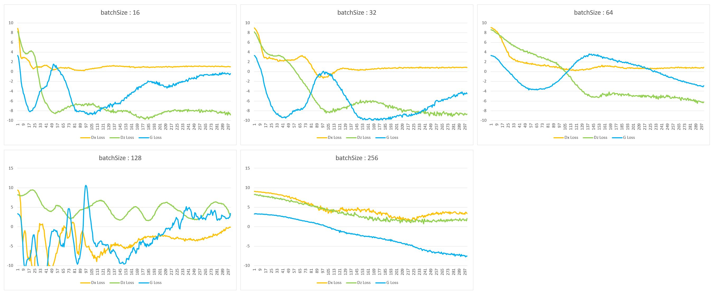
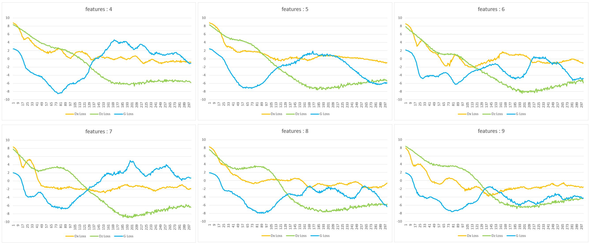
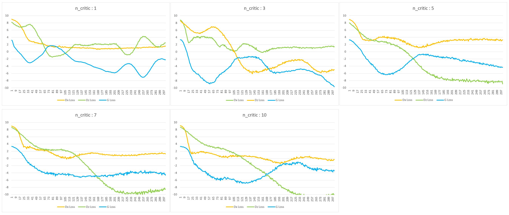
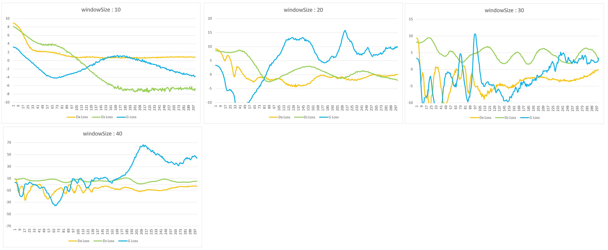

# Hyper Params Tuning

## 1. 파라미터 변동 및 고정 수치

- Learning Rate : 0.00001 고정
- epoch : 300 고정
- batch_Size : 16, 32, 128, 256 (현우)
- features : 3 ~ 10 (현우)
- n_critic : 1, 3, 7, 10 (준영)
- windowSize : 20, 30, 40, 50 (준영)

---

## 2. 파라미터 결과값

#### :pager: [Data](https://github.com/KAMP-Battery-Analysis/Code_Study/blob/main/Week_6/LearningSheet2.xlsx) - 데이터 excel 정리 결과

#### 1. batch_Size

| 담당자 | 내용      | 의견                                                                                                                                       |
| ------ | --------- | ------------------------------------------------------------------------------------------------------------------------------------------ |
| 복현우 | 내용 기입 | 전반적으로 G Loss의 변동이 Dx, Dz Loss의 변동에 비해 상대적으로 큰 것을 확인할 수 있다.                                                    |
|        |           | 배치 사이즈가 16에서 64로 증가함에 따라 각 손실의 변동 기울기가 완만해지는 것을 확인할 수 있다.                                            |
|        |           | 배치 사이즈 128에서 가장 불안정한 손실 변동을 보인다.                                                                                      |
|        |           | 배치 사이즈 16에서 각 손실이 일정 범위로 수렴하는 형태를 보이나 배치 사이즈가 커짐에 따라 수렴하는 형태가 보이지 않는 것을 확인할 수 있다. |
|        |           | 배치 사이즈 256에서는 계속해서 최적 해를 찾아가고 있는 것으로 보이며, 이를 위해 더 큰 에포크를 시도해 볼 필요가 있다.                      |
|        |           | 에포크를 늘림으로써 앞서 언급한 배치사이즈 증가에 따른 변동 기울기 완만의 문제도 확인해 볼 수 있다.                                        |
| 박준영 | 내용 기입 | 내용 기입                                                                                                                                  |

#### 2. features

| 담당자 | 내용      | 의견                                                                                                    |
| ------ | --------- | ------------------------------------------------------------------------------------------------------- |
| 복현우 | 내용 기입 | 모든 특징 수에서 Dx, Dz Loss는 일정 수준 안정되는 경향이 있으나, G Loss는 그렇지 않다.                  |
|        |           | 특징 수 증가에 따른 손실의 안정화 추세가 보이지 않으며, 4~8 사이 특징 수를 선택하는 것이 적절해 보인다. |
| 박준영 | 내용 기입 | 내용 기입                                                                                               |

#### 3. n_critic

| 담당자 | 내용      | 의견                                                                                                 |
| ------ | --------- | ---------------------------------------------------------------------------------------------------- |
| 복현우 | 내용 기입 | n_critic이 커짐에 따라 각 손실들이 수렴하는 형태를 보인다.                                           |
|        |           | 하지만 손실들이 다소 0보다 커지는 경향이 있으며, Dz Loss를 확인하면 그 차이가 명확히 보인다.         |
|        |           | 손실 값과 손실 값의 수렴을 고려했을 때, n_critic 값은 5, 7로 설정하는 것이 상대적으로 적절해 보인다. |
| 박준영 | 내용 기입 | 내용 기입                                                                                            |

#### 4. window_Size

| 담당자 | 내용      | 의견                                                                                                                                            |
| ------ | --------- | ----------------------------------------------------------------------------------------------------------------------------------------------- |
| 복현우 | 내용 기입 | 윈도우 사이즈를 크게 함에 따라 변동이 크게 요동치는 것을 확인할 수 있다.                                                                        |
|        |           | 윈도우 사이즈가 커짐에 따라 변동 폭도 커지는 것을 그래프 좌측의 scale을 통해 확인할 수 있다.                                                    |
|        |           | 윈도우 사이즈에 따라 예측 범위가 달라지므로 loss가 커지는 것은 당연한 일로 윈도우 사이즈를 결정하는 것은 조금 더 추가적인 논의가 필요해 보인다. |
| 박준영 | 내용 기입 | 내용 기입                                                                                                                                       |

